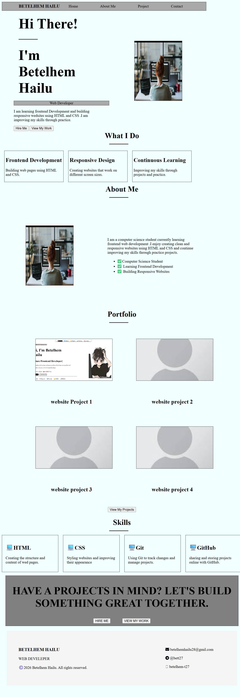

# Personal Portfolio Website

This is a simple personal portfolio website built using HTML and CSS.

It is designed to showcase my personal information, skills, and services as a beginner frontend developer.

## Technology Used

HTML

CSS

## Screenshot

## What I Learned

How to structure a webpage using HTML.

How to style layouts using CSS

How to use Flexbox for alignment

How to make a responsive website for different screen sizes

How to organize sections like hero, skills, and footers